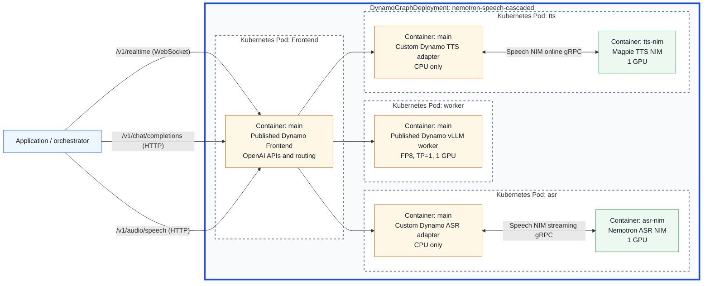

<!--
SPDX-FileCopyrightText: Copyright (c) 2025-2026 NVIDIA CORPORATION & AFFILIATES. All rights reserved.
SPDX-License-Identifier: Apache-2.0

Licensed under the Apache License, Version 2.0 (the "License");
you may not use this file except in compliance with the License.
You may obtain a copy of the License at

http://www.apache.org/licenses/LICENSE-2.0

Unless required by applicable law or agreed to in writing, software
distributed under the License is distributed on an "AS IS" BASIS,
WITHOUT WARRANTIES OR CONDITIONS OF ANY KIND, either express or implied.
See the License for the specific language governing permissions and
limitations under the License.
-->

# Nemotron Speech adapters for a cascaded voice agent

This example exposes NVIDIA Speech NIM microservices serving Nemotron models
through NVIDIA Dynamo's standard OpenAI-compatible APIs. It deploys independent
ASR, LLM, and TTS endpoints with a standalone speech smoke test. A client
application remains responsible for the cascade, conversation state, turn
taking, tools, and barge-in.

NVIDIA documents these containers as
[NVIDIA Speech NIM microservices](https://docs.nvidia.com/nim/speech/latest/index.html),
which serve Nemotron Speech models. The adapter intentionally uses `nvidia-riva-client`, which the current Speech
NIM documentation specifies for gRPC access.



The thick blue border is the DGD, dashed borders are Kubernetes pods, and each
labeled inner box is a container. The application runs outside the DGD and is
not included in this example.

The deployment serves these models:

| Stage | Model |
| --- | --- |
| ASR | Nemotron ASR Streaming 1.2.0, English streaming profile |
| LLM | NVIDIA Nemotron 3 Nano 30B A3B FP8 |
| TTS | Magpie TTS Multilingual 1.8.0 |

## Deploy on Kubernetes

The manifest creates a Dynamo frontend, a vLLM worker, and separate ASR and TTS
worker pods. Each speech worker runs a Speech NIM as a sidecar. The deployment
uses three GPUs in total, one for each model.
The ASR worker appends 400 ms of PCM silence on explicit commits to flush short
utterances without a real-time wait.

### Prerequisites

- A Kubernetes cluster with at least three NVIDIA GPUs and the
  [Dynamo Kubernetes Platform](../../docs/fern/pages/kubernetes/getting-started/quickstart.mdx)
  installed, with an operator and CRDs that support `nvidia.com/v1beta1`.
- Docker and `envsubst`, plus access to a registry that the cluster can pull
  from.
- An NGC API key with access to the ASR and TTS NIM images.
- A Hugging Face token with access to the Nemotron LLM.
- A ReadWriteMany storage class for the shared model cache.

The runtime must support realtime transcription, streaming `/v1/audio/speech`,
and `register_model(skip_model_assets=True)` for external audio models.
Published Dynamo **1.5.0 is not compatible** with this example. Until a release
includes these capabilities, use source-built runtime images with rebuilt Python
bindings from a revision that provides that registration option. See the
[frontend image build instructions](../../container/README.md#building-the-frontend-image).
Building only the adapter image below does not rebuild the Dynamo runtime.

Run all commands from the Dynamo repository root. Set the deployment values
once:

```bash
export NAMESPACE=voice-agent
export DYNAMO_RUNTIME_VERSION=<compatible-runtime-version>
export DYNAMO_FRONTEND_IMAGE="nvcr.io/nvidia/ai-dynamo/dynamo-frontend:${DYNAMO_RUNTIME_VERSION}"
export DYNAMO_VLLM_IMAGE="nvcr.io/nvidia/ai-dynamo/vllm-runtime:${DYNAMO_RUNTIME_VERSION}"
export CUSTOM_IMAGE_REGISTRY=<registry-host>
export CUSTOM_IMAGE_REPOSITORY=<project>
export CUSTOM_SPEECH_ADAPTER_IMAGE="${CUSTOM_IMAGE_REGISTRY}/${CUSTOM_IMAGE_REPOSITORY}/dynamo-nemotron-speech-adapter:${DYNAMO_RUNTIME_VERSION}"
export CUSTOM_IMAGE_REGISTRY_USER=<username>
export CUSTOM_IMAGE_REGISTRY_PASSWORD=<password>
export NGC_API_KEY=<ngc-api-key>
export HF_TOKEN=<hugging-face-token>
export RWX_STORAGE_CLASS=<rwx-storage-class>
```

For source builds, replace `DYNAMO_FRONTEND_IMAGE` and `DYNAMO_VLLM_IMAGE` with
your pushed image references before continuing. Use the same Dynamo runtime
version for the runtime images and the custom adapter image. Its semantic tag
lets the Dynamo operator derive compatibility
directly from each component's main image. The custom image can use any OCI
registry; the published Dynamo images are pulled directly from NVCR.

### 1. Build and push the adapter image

The speech worker's main container is a small CPU-only adapter. It derives from
the selected Dynamo frontend image, which provides the Dynamo runtime without
vLLM, and adds the Riva client and this example's adapter code:

```bash
./examples/nemotron_speech_cascaded_pipeline/container/build.sh
printf '%s' "${CUSTOM_IMAGE_REGISTRY_PASSWORD}" | docker login "${CUSTOM_IMAGE_REGISTRY}" \
  --username "${CUSTOM_IMAGE_REGISTRY_USER}" --password-stdin
docker push "${CUSTOM_SPEECH_ADAPTER_IMAGE}"
```

The installer preserves the base image's `protobuf` and `websockets` versions
using scoped `uv` overrides. These intentionally override Riva 2.26's declared
constraints, so `uv pip check` still reports those metadata conflicts. Validation
covers the adapter's gRPC paths, not the Riva client's WebSocket APIs.

### 2. Create the namespace and credentials

```bash
kubectl create namespace "${NAMESPACE}" --dry-run=client -o yaml \
  | kubectl apply -f -

kubectl create secret docker-registry custom-adapter-image-pull-secret \
  --namespace "${NAMESPACE}" \
  --docker-server "${CUSTOM_IMAGE_REGISTRY}" \
  --docker-username "${CUSTOM_IMAGE_REGISTRY_USER}" \
  --docker-password "${CUSTOM_IMAGE_REGISTRY_PASSWORD}" \
  --dry-run=client -o yaml | kubectl apply -f -

kubectl create secret docker-registry ngc-secret \
  --namespace "${NAMESPACE}" \
  --docker-server nvcr.io \
  --docker-username '$oauthtoken' \
  --docker-password "${NGC_API_KEY}" \
  --dry-run=client -o yaml | kubectl apply -f -

kubectl create secret generic ngc-api \
  --namespace "${NAMESPACE}" \
  --from-literal=NGC_API_KEY="${NGC_API_KEY}" \
  --dry-run=client -o yaml | kubectl apply -f -

kubectl create secret generic hf-token-secret \
  --namespace "${NAMESPACE}" \
  --from-literal=HF_TOKEN="${HF_TOKEN}" \
  --dry-run=client -o yaml | kubectl apply -f -
```

The custom registry credentials are only needed for a private adapter image.
For a public image, omit that secret and remove
`custom-adapter-image-pull-secret` from the speech worker pod templates.

### 3. Create the shared model cache

The three model pods may run on different nodes, so the cache must support
`ReadWriteMany`:

```bash
kubectl apply --namespace "${NAMESPACE}" -f - <<EOF
apiVersion: v1
kind: PersistentVolumeClaim
metadata:
  name: model-cache
spec:
  accessModes:
    - ReadWriteMany
  storageClassName: ${RWX_STORAGE_CLASS}
  resources:
    requests:
      storage: 200Gi
EOF
```

### 4. Deploy the graph

Render the image environment variables while applying the tracked manifest:

```bash
envsubst '${DYNAMO_FRONTEND_IMAGE} ${DYNAMO_VLLM_IMAGE} ${CUSTOM_SPEECH_ADAPTER_IMAGE}' \
  < examples/nemotron_speech_cascaded_pipeline/deploy/agg.yaml \
  | kubectl apply --namespace "${NAMESPACE}" -f -
```

Watch the model pods start. Initial NIM and LLM downloads can take several
minutes:

```bash
kubectl get dgd nemotron-speech-cascaded --namespace "${NAMESPACE}"
kubectl get pods --namespace "${NAMESPACE}" \
  --selector nvidia.com/dynamo-graph-deployment-name=nemotron-speech-cascaded --watch
```

After the pods appear, wait for every container to become ready:

```bash
kubectl wait --namespace "${NAMESPACE}" --for=condition=Ready pod \
  --selector nvidia.com/dynamo-graph-deployment-name=nemotron-speech-cascaded \
  --timeout=45m
```

If a pod does not become ready, inspect its events and container logs:

```bash
kubectl describe pod --namespace "${NAMESPACE}" \
  --selector nvidia.com/dynamo-graph-deployment-name=nemotron-speech-cascaded
kubectl logs --namespace "${NAMESPACE}" \
  --selector nvidia.com/dynamo-component=asr \
  --container asr-nim --tail=100
```

### 5. Connect and validate

Forward the generated frontend service:

```bash
kubectl port-forward --namespace "${NAMESPACE}" \
  service/nemotron-speech-cascaded-frontend 8000:8000
```

Keep this command running during validation. It binds only to localhost; the
example does not configure API authentication.

The deployment exposes:

- `ws://localhost:8000/v1/realtime`, transcription using 24 kHz PCM
- `http://localhost:8000/v1/chat/completions`
- `http://localhost:8000/v1/audio/speech`, streaming 24 kHz PCM

In another terminal, install the small client dependency and exercise TTS and
ASR together:

```bash
python3 -m pip install aiohttp
python3 examples/nemotron_speech_cascaded_pipeline/smoke_speech_loop.py
```

The check reports TTS TTFB, ASR first-transcript latency, PCM RMS, and the final
transcript. It fails on an API error, silent audio, or an empty transcript.

Verify the LLM separately:

```bash
curl --fail --silent --show-error http://localhost:8000/v1/chat/completions \
  --header 'Content-Type: application/json' \
  --data '{
    "model": "nvidia/nemotron-3-nano",
    "messages": [{"role": "user", "content": "Reply with one short greeting."}],
    "max_tokens": 64,
    "chat_template_kwargs": {"enable_thinking": false}
  }'
```

The TTS adapter requires a Dynamo runtime with streaming
`/v1/audio/speech` support. The realtime ASR adapter uses explicit client commits
(`turn_detection: null`); it does not implement server-side voice activity
detection (VAD).

Each ASR worker admits up to 32 active turns across all clients, configurable
with `--max-concurrent-turns`. Excess turns receive a transcription failure
immediately rather than waiting for a consumer thread. The TTS adapter rejects
unsupported cloning and generation controls instead of silently ignoring them.

## External Orchestration

Connect these endpoints to an external voice application, for example:

- [Pipecat](https://docs.pipecat.ai/pipecat/learn/pipeline): build an ASR -> LLM ->
  TTS pipeline with service clients that use the Dynamo endpoints below.
- [NVIDIA Nemotron Voice Agent Blueprint](https://github.com/NVIDIA-AI-Blueprints/nemotron-voice-agent):
  reuse its browser UI and Pipecat pipeline, adapting its model-service clients
  to call Dynamo instead of the model backends directly.

These are optional integrations, not dependencies of this example. Direct Riva
gRPC clients need HTTP/WebSocket replacements, not just a different server URL.
Use `http://localhost:8000/v1` for HTTP and
`ws://localhost:8000/v1/realtime` for transcription:

| Stage | Client behavior |
| --- | --- |
| ASR | Use model `nemotron-asr-streaming` and `session.type="transcription"`. Send base64-encoded 24 kHz mono PCM16 audio with `input_audio_buffer.append`, then `input_audio_buffer.commit` at the end of each turn. |
| LLM | Send the transcript and conversation history to `/v1/chat/completions` with model `nvidia/nemotron-3-nano` and `stream: true`. |
| TTS | Send generated text to `/v1/audio/speech` with model `nvidia/magpie-tts-multilingual`, voice `Magpie-Multilingual.EN-US.Aria`, and `response_format="pcm"`; play the 24 kHz mono PCM16 response chunks as they arrive. |

Keep turn detection, conversation history, and interruptions in the application.
To overlap LLM generation with speech playback, aggregate generated text into
sentence-sized TTS requests rather than waiting for the full LLM response.
The included `smoke_speech_loop.py` demonstrates the ASR and TTS wire contracts;
no orchestrator installation is required to validate the deployment.

## Clean Up

Stop the Kubernetes port-forward with `Ctrl-C` in its terminal.

Remove the model deployment to release its GPUs. The model cache and credentials
remain available for the next deployment:

```bash
kubectl delete dgd nemotron-speech-cascaded --namespace "${NAMESPACE}"
```

## Tests

Running the adapter workers or unit tests outside the container requires Python
3.11 or newer.

The example's unit tests cover connection configuration and endpoint resolution
without installing the Riva client. Model-registration regressions are covered
by `lib/bindings/python/tests/test_runtime_data_discovery.py` in the regular
Dynamo binding suite. The Riva-dependent adapter, worker, and connection modules
have no automated test coverage. Run the deployed smoke test manually for
functional validation.

```bash
python3 -m pip install pytest
PYTHONPATH=components/src:lib/bindings/python/src \
  python3 -m pytest -xvv examples/nemotron_speech_cascaded_pipeline/tests
bash -n examples/nemotron_speech_cascaded_pipeline/launch_workers.sh
bash -n examples/nemotron_speech_cascaded_pipeline/container/build.sh
bash -n examples/nemotron_speech_cascaded_pipeline/container/install.sh
pre-commit run check-yaml --files examples/nemotron_speech_cascaded_pipeline/deploy/agg.yaml
```

For functional validation, run `smoke_speech_loop.py` and confirm that the
transcript matches the synthesized sentence closely enough to recognize the
intended text.
